# Project 3 Report: Making Systems Fault Tolerant via 2PC & Raft

## Team Members (Group #8)

| Name | Student ID | Contribution |
|------|-----------|--------------|
| Malaika Farooq | 1002311562 | 2PC implementation (Q1 & Q2), containerization, testing |
| Yuanbin Man | 1002296616 | Raft implementation (Q3 & Q4), test cases (Q5), report |

**GitHub:** https://github.com/malaika-farooq/DistributedSystems_2PC-Raft

---

## System Portal

**Web Application Home Page:**

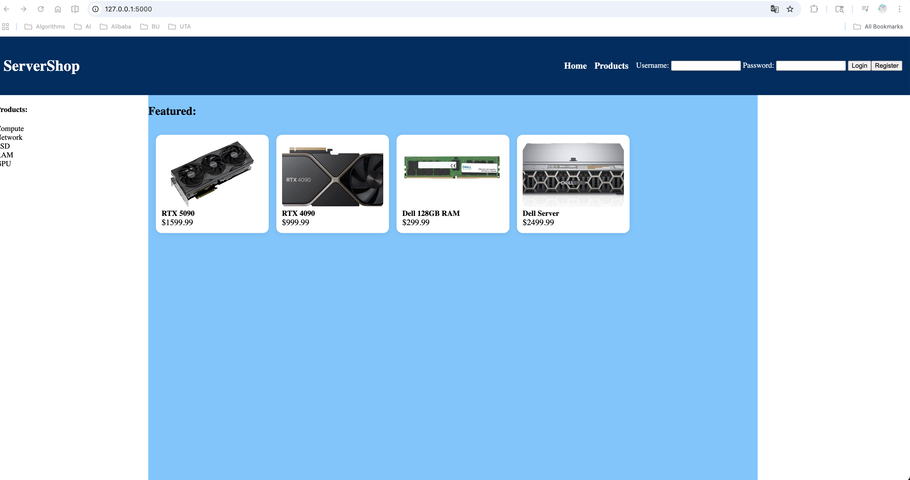

**Product Listing Page:**


**Shopping Cart Page:**

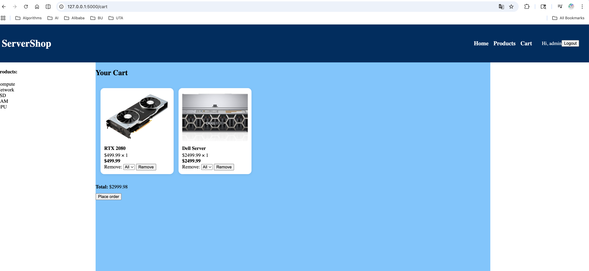

**Place Order (2PC Trigger):**

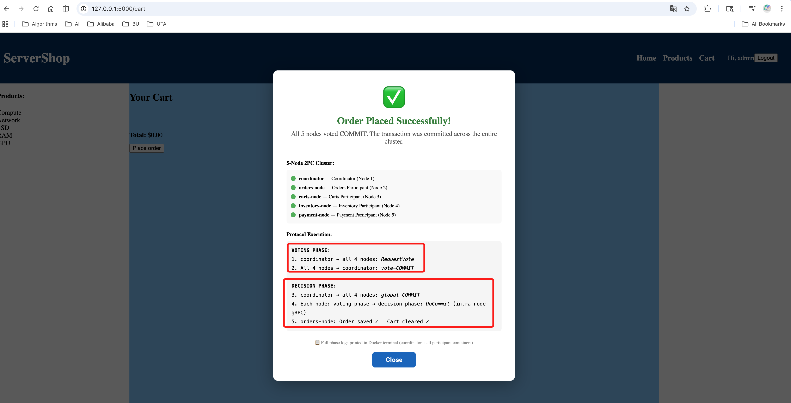

---

## Q1. 2PC Voting Phase

### Requirement

> Implement the voting phase of 2PC on one of the three selected implementations. The coordinator sends a vote-request message to all participants. When a participant receives a vote-request message, it returns either a vote-commit message or a vote-abort message. Containerize for at least 5 nodes.

### Implementation

We implemented 2PC on the **PlaceOrder** functionality of the ServerShop e-commerce application. The 2PC cluster consists of **5 nodes** (1 coordinator + 4 participants), each running in a separate Docker container.

**5-Node Architecture:**

| Node   | Container                      | Role                         | Ports  |
|--------|--------------------------------|------------------------------|--------|
| Node 1 | `microservice-2pc-coordinator` | Coordinator                  | 50060  |
| Node 2 | `microservice-orders`          | Participant — orders         | 50056  |
| Node 3 | `participant-carts`            | Participant — carts          | 50062  |
| Node 4 | `participant-3`                | Participant — inventory      | 50064  |
| Node 5 | `participant-4`                | Participant — payment        | 50066  |

**gRPC Definitions** (`proto/twopc.proto`):

```protobuf
message VoteRequest {
  string transaction_id = 1;
  string user_id        = 2;
}

message VoteResponse {
  string transaction_id = 1;
  string node_id        = 2;
  bool   vote_commit    = 3;   // true = COMMIT, false = ABORT
  string reason         = 4;
}

service ParticipantService {
  rpc RequestVote (VoteRequest) returns (VoteResponse);
  // ...
}
```

**Coordinator sends RequestVote to all participants** (`microservice-2pc-coordinator/coordinator.py`, lines 69-91):

```python
for stub, label in stubs:
    log_send("voting", "RequestVote", "voting", label)
    try:
        resp = stub.RequestVote(
            twopc_pb2.VoteRequest(transaction_id=txn_id, user_id=user_id)
        )
        votes[label] = resp.vote_commit
    except grpc.RpcError as e:
        votes[label] = False  # unreachable = ABORT
```

**Participant handles RequestVote** (`microservice-2pc-participant/participant.py`, lines 101-127):

```python
def RequestVote(self, request, context):
    log_recv("voting", "RequestVote", "voting", "coordinator")
    can_commit = bool(user_id)  # role-specific readiness check
    return twopc_pb2.VoteResponse(
        transaction_id=txn_id, node_id=NODE_ID,
        vote_commit=can_commit, reason="Ready" if can_commit else "No user_id"
    )
```

**Orders node** (`microservice-orders/order_server.py`, lines 176-207) has additional logic: it votes ABORT if the user's cart is empty, and COMMIT if the cart has items.

### Evidence — Voting Phase Test Results

| Test | Result | Duration | Detail |
|------|--------|----------|--------|
| All 4 participants voted COMMIT | PASS | 323 ms | Coordinator collected COMMIT from all participants |
| Empty cart causes ABORT vote | PASS | 82 ms | orders-node checked cart -> empty -> voted ABORT -> global ABORT |

**Screenshot — Voting Phase Logs (docker compose logs):**

<!-- TODO: Replace with actual screenshot -->
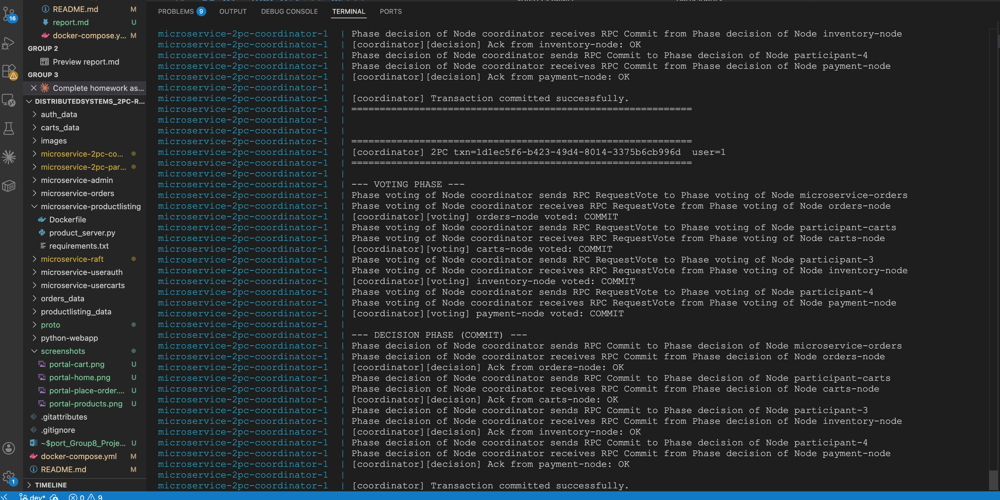

**Screenshot — 5 Containers Running (docker compose ps):**

<!-- TODO: Replace with actual screenshot -->
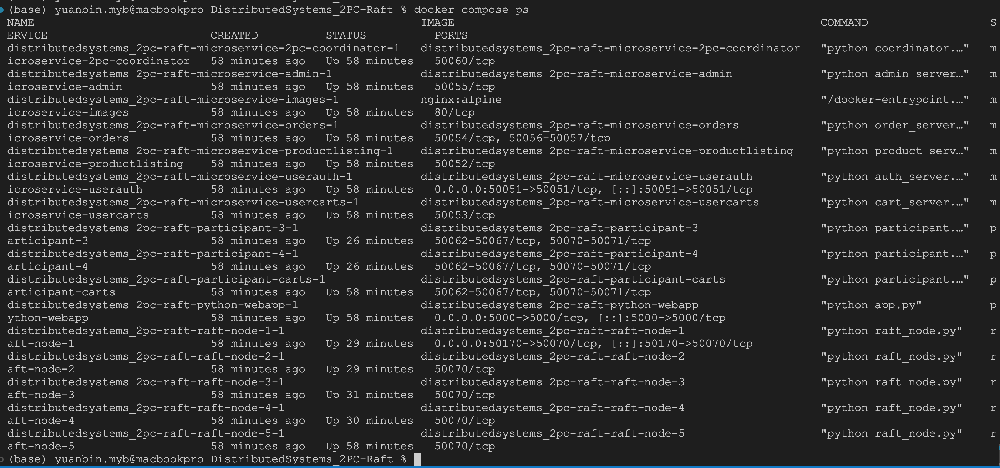

---

## Q2. 2PC Decision Phase

### Requirement

> Implement the decision phase of 2PC. The coordinator collects all votes; if all voted commit, send global-commit; if any voted abort, send global-abort. Each participant executes locally. Use gRPC for intra-node communication between voting and decision phases. Print required log format for every RPC call.

### Implementation

**gRPC Definitions** (`proto/twopc.proto`):

Inter-node (coordinator <-> participants):

```protobuf
message GlobalDecision {
  string transaction_id = 1;
  bool   commit         = 2;   // true = global-commit, false = global-abort
}

message AckResponse {
  string transaction_id = 1;
  string node_id        = 2;
  bool   ok             = 3;
  string message        = 4;
}

service ParticipantService {
  rpc RequestVote (VoteRequest) returns (VoteResponse);
  rpc Commit (GlobalDecision) returns (AckResponse);
  rpc Abort  (GlobalDecision) returns (AckResponse);
}
```

Intra-node (voting phase <-> decision phase on same container, via gRPC):

```protobuf
service IntraNodeVotingService {
  rpc PrepareVote (IntraVoteRequest) returns (IntraVoteResponse);
}

service IntraNodeDecisionService {
  rpc DoCommit (IntraCommitRequest) returns (IntraCommitResponse);
  rpc DoAbort  (IntraAbortRequest)  returns (IntraAbortResponse);
}
```

Each participant node runs **two gRPC servers** inside the same container:
- **Voting Phase Server** (e.g. port 50056) — receives `Commit`/`Abort` from coordinator
- **Decision Phase Server** (e.g. port 50057) — receives `DoCommit`/`DoAbort` from voting phase via localhost gRPC

This satisfies Q2's requirement that both phases use gRPC even if implemented in different languages.

**Coordinator decision logic** (`coordinator.py`, lines 94-118):

```python
global_commit = all(votes.values())
for stub, label in stubs:
    rpc_name = "Commit" if global_commit else "Abort"
    log_send("decision", rpc_name, "decision", label)
    ack = stub.Commit(decision) if global_commit else stub.Abort(decision)
```

**Participant intra-node forwarding** (`participant.py`, lines 129-143):

```python
def Commit(self, request, context):
    log_recv("decision", "Commit", "decision", "coordinator")
    # Forward to decision phase via intra-node gRPC
    log_send("decision", "DoCommit", "decision", NODE_ID)
    resp = self._decision.DoCommit(
        twopc_pb2.IntraCommitRequest(transaction_id=txn_id, user_id=user_id)
    )
```

**Decision phase server** (`participant.py`, lines 60-72):

```python
def DoCommit(self, request, context):
    log_recv("decision", "DoCommit", "voting", NODE_ID)
    # Execute local commit action (role-specific)
    return twopc_pb2.IntraCommitResponse(transaction_id=txn_id, ok=True, ...)
```

### Log Format

Every gRPC call prints (implemented in `coordinator.py` lines 36-47, `participant.py` lines 39-51, `order_server.py` lines 71-83):

```
# Client side:
Phase <phase> of Node <node_id> sends RPC <rpc_name> to Phase <phase> of Node <node_id>

# Server side:
Phase <phase> of Node <node_id> receives RPC <rpc_name> from Phase <phase> of Node <node_id>
```

Example output from a committed transaction:

```
Phase voting of Node coordinator sends RPC RequestVote to Phase voting of Node orders-node
Phase voting of Node orders-node receives RPC RequestVote from Phase voting of Node coordinator
Phase voting of Node coordinator sends RPC RequestVote to Phase voting of Node carts-node
Phase voting of Node carts-node receives RPC RequestVote from Phase voting of Node coordinator
Phase voting of Node coordinator sends RPC RequestVote to Phase voting of Node inventory-node
Phase voting of Node inventory-node receives RPC RequestVote from Phase voting of Node coordinator
Phase voting of Node coordinator sends RPC RequestVote to Phase voting of Node payment-node
Phase voting of Node payment-node receives RPC RequestVote from Phase voting of Node coordinator
Phase decision of Node coordinator sends RPC Commit to Phase decision of Node orders-node
Phase decision of Node orders-node receives RPC Commit from Phase decision of Node coordinator
Phase decision of Node orders-node sends RPC DoCommit to Phase decision of Node orders-node
Phase decision of Node orders-node receives RPC DoCommit from Phase voting of Node orders-node
Phase decision of Node coordinator sends RPC Commit to Phase decision of Node carts-node
Phase decision of Node carts-node receives RPC Commit from Phase decision of Node coordinator
Phase decision of Node carts-node sends RPC DoCommit to Phase decision of Node carts-node
Phase decision of Node carts-node receives RPC DoCommit from Phase voting of Node carts-node
Phase decision of Node coordinator sends RPC Commit to Phase decision of Node inventory-node
Phase decision of Node inventory-node receives RPC Commit from Phase decision of Node coordinator
Phase decision of Node coordinator sends RPC Commit to Phase decision of Node payment-node
Phase decision of Node payment-node receives RPC Commit from Phase decision of Node coordinator
```

### Evidence — Decision Phase Test Results

| Test | Result | Duration | Detail |
|------|--------|----------|--------|
| Cart cleared after commit | PASS | — | Cart: 1 item(s) before -> 0 items after |
| Order record saved to database | PASS | — | orders-node committed order UUID to SQLite DB |
| No phantom order saved | PASS | — | Database unchanged for empty cart |
| COMMIT: cart atomically cleared | PASS | 173 ms | 2 items -> 0 in one atomic 2PC transaction |
| COMMIT: order saved + cart cleared together | PASS | — | Both operations committed atomically |
| ABORT: cart completely unchanged | PASS | 8,037 ms | Cart still has 2 item(s) -- zero partial commits |
| ABORT: no order saved | PASS | — | Database unchanged -- 2PC rollback worked |
| Transaction aborted when node unreachable | PASS | 16,037 ms | Coordinator treated missing node as ABORT vote |
| Cart preserved on ABORT | PASS | — | Cart still has 1 item(s) -- no partial commit |
| System recovered after node restart | PASS | 367 ms | Transaction committed after node came back |

### 2PC Latency Measurements (5 consecutive transactions)

| Metric | Value |
|--------|-------|
| Min latency | 164.5 ms |
| Max latency | 271.8 ms |
| Average latency | 213.8 ms |
| Threshold check | 213.8 ms < 5,000 ms (PASS) |

**Screenshot — Decision Phase Logs (commit flow):**


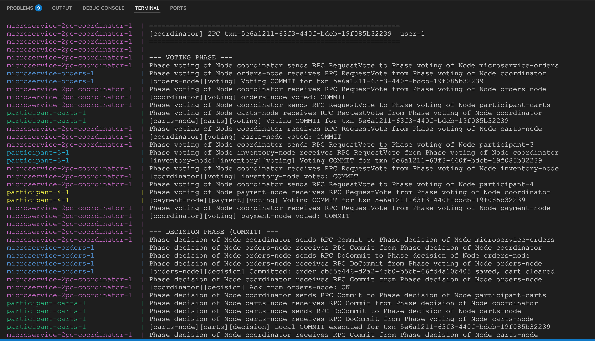

**Screenshot — Decision Phase Logs (abort flow):**


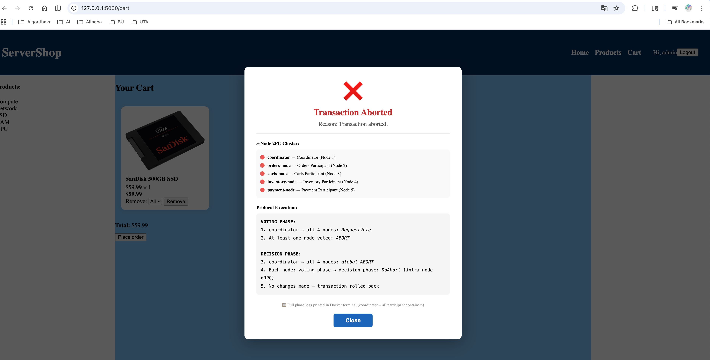
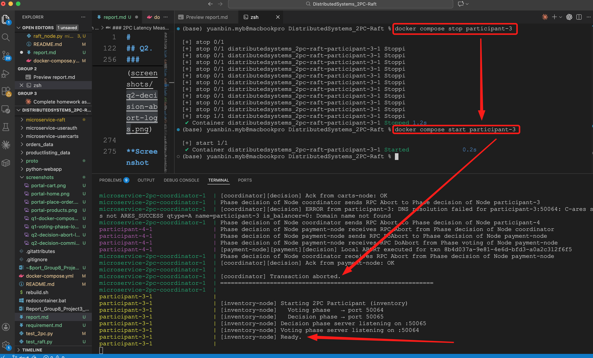
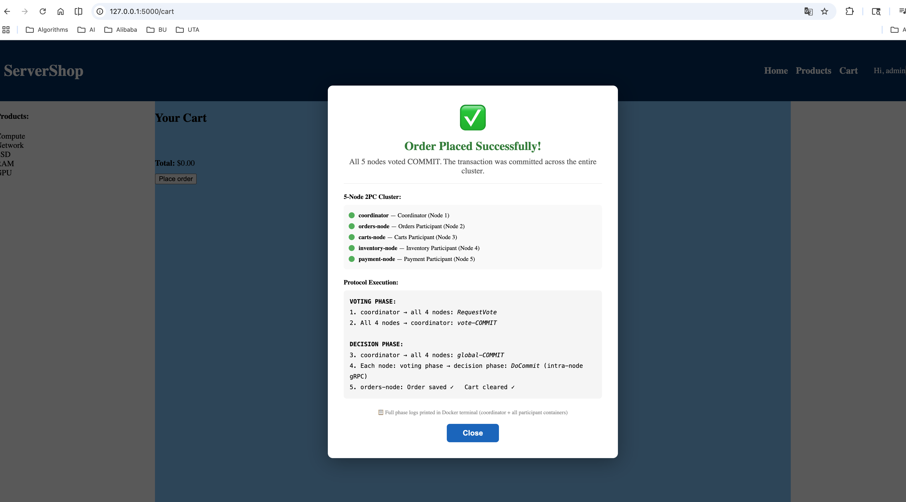

**Screenshot — Intra-Node gRPC Logs (DoCommit/DoAbort):**


<!--  -->

### Full 2PC Test Summary

**17/17 tests PASS** — run via `python test_2pc.py`

| # | Test | Result | Duration | Detail |
|---|------|--------|----------|--------|
| 1 | Add item to cart | PASS | — | Item 1 added successfully |
| 2 | 2PC committed — all 4 participants voted COMMIT | PASS | 323 ms | |
| 3 | Cart cleared after commit | PASS | — | 1 item -> 0 items |
| 4 | Order record saved to database | PASS | — | UUID committed to SQLite |
| 5 | Empty cart causes ABORT vote | PASS | 82 ms | orders-node voted ABORT |
| 6 | No phantom order saved | PASS | — | DB unchanged |
| 7 | Min latency | PASS | — | 164.5 ms |
| 8 | Max latency | PASS | — | 271.8 ms |
| 9 | Average latency (5 runs) | PASS | — | 213.8 ms |
| 10 | Within acceptable threshold | PASS | — | < 5,000 ms |
| 11 | COMMIT: cart atomically cleared | PASS | 173 ms | 2 items -> 0 |
| 12 | COMMIT: order saved + cart cleared together | PASS | — | Atomic |
| 13 | ABORT: cart completely unchanged | PASS | 8,037 ms | No partial commit |
| 14 | ABORT: no order saved | PASS | — | DB unchanged |
| 15 | Transaction aborted when node unreachable | PASS | 16,037 ms | Missing node = ABORT |
| 16 | Cart preserved on ABORT | PASS | — | No partial commit |
| 17 | System recovered after node restart | PASS | 367 ms | Committed after recovery |

**Screenshot — 2PC Test Suite Output (python test_2pc.py):**

<!-- TODO: Replace with actual screenshot -->
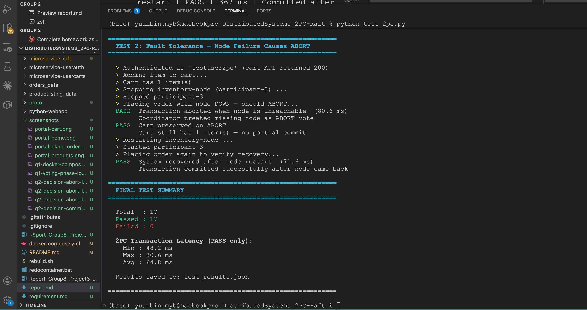

---

## Q3. Raft Leader Election

### Requirement

> Implement leader election with heartbeat timeout of 1 second, election timeout randomly chosen from [1.5s, 3s]. All nodes start as followers. Candidate increments term, votes for itself, sends RequestVote RPCs. Majority wins. Print required log format. Containerize for at least 5 nodes.

### Implementation

**5-Node Raft Architecture:**

| Node | Container | Ports |
|------|-----------|-------|
| Raft Node 1 | `raft-node-1` | 50070 (internal), 50170 (host) |
| Raft Node 2 | `raft-node-2` | 50070 |
| Raft Node 3 | `raft-node-3` | 50070 |
| Raft Node 4 | `raft-node-4` | 50070 |
| Raft Node 5 | `raft-node-5` | 50070 |

**Timeouts** (`raft_node.py`, lines 38-40):

```python
HEARTBEAT_INTERVAL   = 1.0   # 1 second
ELECTION_TIMEOUT_MIN = 1.5   # [1.5s, 3.0s] random per node
ELECTION_TIMEOUT_MAX = 3.0
```

**gRPC Definitions** (`proto/raft.proto`):

```protobuf
message RequestVoteRequest {
  int32  term            = 1;
  string candidate_id   = 2;
  int32  last_log_index = 3;
  int32  last_log_term  = 4;
}

message RequestVoteResponse {
  int32 term         = 1;
  bool  vote_granted = 2;
}

message AppendEntriesRequest {
  int32             term          = 1;
  string            leader_id     = 2;
  repeated LogEntry entries       = 3;
  int32             leader_commit = 4;
}

service RaftService {
  rpc RequestVote   (RequestVoteRequest)   returns (RequestVoteResponse);
  rpc AppendEntries (AppendEntriesRequest) returns (AppendEntriesResponse);
}
```

**All nodes start as followers** (`raft_node.py`, lines 59-92):

```python
class RaftNode(raft_pb2_grpc.RaftServiceServicer):
    def __init__(self):
        self.current_term = 0
        self.voted_for = None
        self.state = "follower"   # all nodes start as follower
        self._reset_election_timer()  # random [1.5s, 3.0s]
```

**Election timeout fires -> start election** (`raft_node.py`, lines 146-219):

```python
def _start_election(self):
    self.state = "candidate"
    self.current_term += 1
    self.voted_for = NODE_ID   # vote for self
    # Send RequestVote to all peers in parallel threads
    for pid, stub in self._peer_stubs.items():
        log_send("RequestVote", pid)
        resp = stub.RequestVote(RequestVoteRequest(
            term=term, candidate_id=NODE_ID,
            last_log_index=last_log_index, last_log_term=last_log_term
        ))
    # Majority check
    if votes >= majority:
        self._become_leader()
```

**Become leader -> start heartbeats** (`raft_node.py`, lines 137-142):

```python
def _become_leader(self):
    self.state = "leader"
    self.leader_id = NODE_ID
    self._cancel_election_timer()
    self._start_heartbeat_timer()  # AppendEntries every 1s
```

**Vote handling — first-come-first-served, checks log completeness** (`raft_node.py`, lines 295-325):

```python
def RequestVote(self, request, context):
    log_run("RequestVote", request.candidate_id)
    if request.term > self.current_term:
        self._become_follower(request.term)
    # Grant vote if: haven't voted yet AND candidate log is up-to-date
    candidate_ok = (request.last_log_term > my_last_term
                    or (request.last_log_term == my_last_term
                        and request.last_log_index >= my_last_index))
    if not already_voted and candidate_ok:
        grant = True
        self.voted_for = request.candidate_id
```

**Step down on higher term** — if a candidate or leader sees a higher term in any RPC response, it immediately reverts to follower (`raft_node.py`, lines 127-134, 180-183, 257-259).

### Log Format

```
# Client side (sending RPC):
Node <node_id> sends RPC <rpc_name> to Node <node_id>

# Server side (handling RPC):
Node <node_id> runs RPC <rpc_name> called by Node <node_id>
```

Example output — leader election:

```
[raft-node-3] Starting election — term 1
Node raft-node-3 sends RPC RequestVote to Node raft-node-1
Node raft-node-3 sends RPC RequestVote to Node raft-node-2
Node raft-node-3 sends RPC RequestVote to Node raft-node-4
Node raft-node-3 sends RPC RequestVote to Node raft-node-5
Node raft-node-1 runs RPC RequestVote called by Node raft-node-3
[raft-node-1] Voted for raft-node-3 in term 1
Node raft-node-2 runs RPC RequestVote called by Node raft-node-3
[raft-node-2] Voted for raft-node-3 in term 1
[raft-node-3] Vote granted by raft-node-1 — total 2/3 needed
[raft-node-3] Vote granted by raft-node-2 — total 3/3 needed
[raft-node-3] → LEADER (term 1)
Node raft-node-3 sends RPC AppendEntries to Node raft-node-1
Node raft-node-3 sends RPC AppendEntries to Node raft-node-2
Node raft-node-3 sends RPC AppendEntries to Node raft-node-4
Node raft-node-3 sends RPC AppendEntries to Node raft-node-5
```

**Screenshot — Leader Election Logs (docker compose logs):**


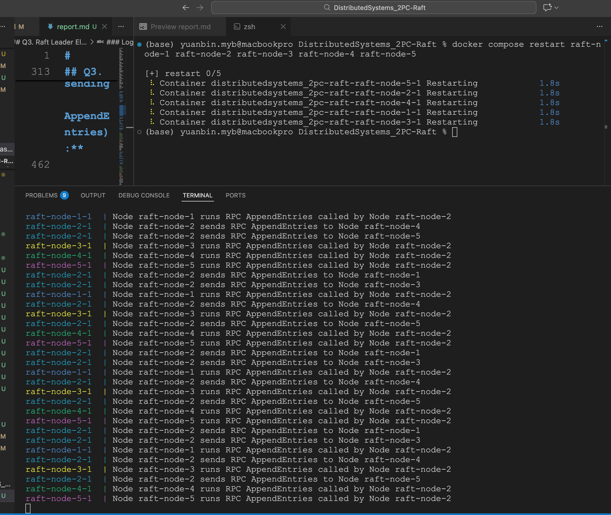

**Screenshot — Heartbeat Logs (leader sending AppendEntries):**

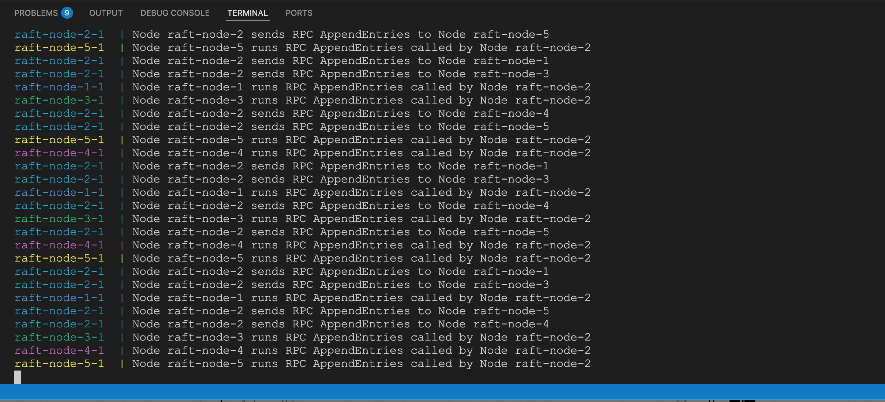

**Screenshot — 5 Raft Containers Running (docker compose ps):**


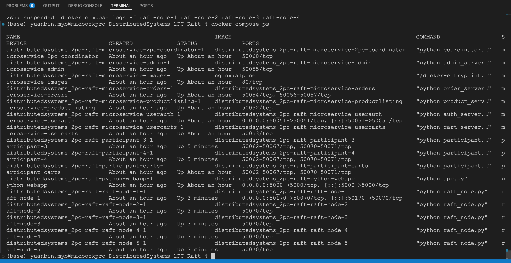

---

## Q4. Raft Log Replication

### Requirement

> Implement log replication. Each node maintains a log. Leader receives client request, appends `<o, t, k+1>` to log, sends entire log + commit index c on heartbeat. Followers copy log, ACK, execute up to c. Leader commits on majority ACK. Non-leader nodes forward client requests to leader.

### Implementation

**gRPC Definitions** (`proto/raft.proto`):

```protobuf
// Log entry: <o, t, k+1> per the spec
message LogEntry {
  int32  term      = 1;   // t
  int32  index     = 2;   // k+1
  string operation = 3;   // o
}

message ClientRequest {
  string operation = 1;   // e.g. "SET x=1"
}

message ClientResponse {
  bool   success   = 1;
  string result    = 2;
  string leader_id = 3;   // hint if this node is not the leader
}

service RaftService {
  rpc AppendEntries    (AppendEntriesRequest) returns (AppendEntriesResponse);
  rpc ExecuteOperation (ClientRequest)        returns (ClientResponse);
}
```

**Non-leader forwards to leader** (`raft_node.py`, lines 374-404):

```python
def ExecuteOperation(self, request, context):
    if my_state != "leader":
        # Forward to known leader
        log_send("ExecuteOperation", my_leader)
        fwd_stub = raft_pb2_grpc.RaftServiceStub(grpc.insecure_channel(leader_addr))
        return fwd_stub.ExecuteOperation(request, timeout=6.0)
```

**Leader appends `<o, t, k+1>` to log** (`raft_node.py`, lines 406-418):

```python
    # This node is the leader — append the entry
    index = len(self.log) + 1
    entry = {
        "term":      self.current_term,    # t
        "index":     index,                # k+1
        "operation": request.operation,    # o
    }
    self.log.append(entry)
```

**Leader sends entire log + commit index c on heartbeat** (`raft_node.py`, lines 222-264):

```python
def _send_heartbeats(self):
    entries = [LogEntry(term=e["term"], index=e["index"], operation=e["operation"])
               for e in log_snapshot]
    for peer_id, stub in self._peer_stubs.items():
        log_send("AppendEntries", peer_id)
        resp = stub.AppendEntries(AppendEntriesRequest(
            term=term, leader_id=NODE_ID,
            entries=entries,              # entire log
            leader_commit=commit_index,   # c
        ))
```

**Leader commits on majority ACK** (`raft_node.py`, lines 275-289):

```python
    total_nodes = len(self._peer_stubs) + 1
    majority = total_nodes // 2 + 1
    if (acks + 1) >= majority and len(self.log) > self.commit_index:
        while self.commit_index < len(self.log):
            self.commit_index += 1
            entry = self.log[self.commit_index - 1]
            print(f"[{NODE_ID}] Committed op '{entry['operation']}' at index {self.commit_index}")
```

**Follower copies entire log and executes up to c** (`raft_node.py`, lines 327-372):

```python
def AppendEntries(self, request, context):
    log_run("AppendEntries", request.leader_id)
    # Copy entire log from leader
    if request.entries:
        self.log = [{"term": e.term, "index": e.index, "operation": e.operation}
                    for e in request.entries]
    # Execute all operations up to leader's commit index c
    new_commit = min(request.leader_commit, len(self.log))
    while self.commit_index < new_commit:
        self.commit_index += 1
        entry = self.log[self.commit_index - 1]
        print(f"[{NODE_ID}] Executed op '{entry['operation']}' at index {self.commit_index}")
```

### Example Log Replication Output

```
# Client submits operation to raft-node-2 (a follower)
Node raft-node-2 sends RPC ExecuteOperation to Node raft-node-3   (forward to leader)

# Leader appends and replicates on next heartbeat
[raft-node-3] Leader appended op 'SET x=42' at index 1
Node raft-node-3 sends RPC AppendEntries to Node raft-node-1
Node raft-node-3 sends RPC AppendEntries to Node raft-node-2
Node raft-node-3 sends RPC AppendEntries to Node raft-node-4
Node raft-node-3 sends RPC AppendEntries to Node raft-node-5
Node raft-node-1 runs RPC AppendEntries called by Node raft-node-3
[raft-node-1] Copied 1-entry log from leader raft-node-3
Node raft-node-2 runs RPC AppendEntries called by Node raft-node-3
[raft-node-2] Copied 1-entry log from leader raft-node-3

# Leader commits after majority ACK
[raft-node-3] Committed op 'SET x=42' at index 1

# Followers execute on next heartbeat (commit index c propagated)
[raft-node-1] Executed op 'SET x=42' at index 1
[raft-node-2] Executed op 'SET x=42' at index 1
[raft-node-4] Executed op 'SET x=42' at index 1
[raft-node-5] Executed op 'SET x=42' at index 1
```

**Screenshot — Log Replication Logs (leader append + follower copy):**


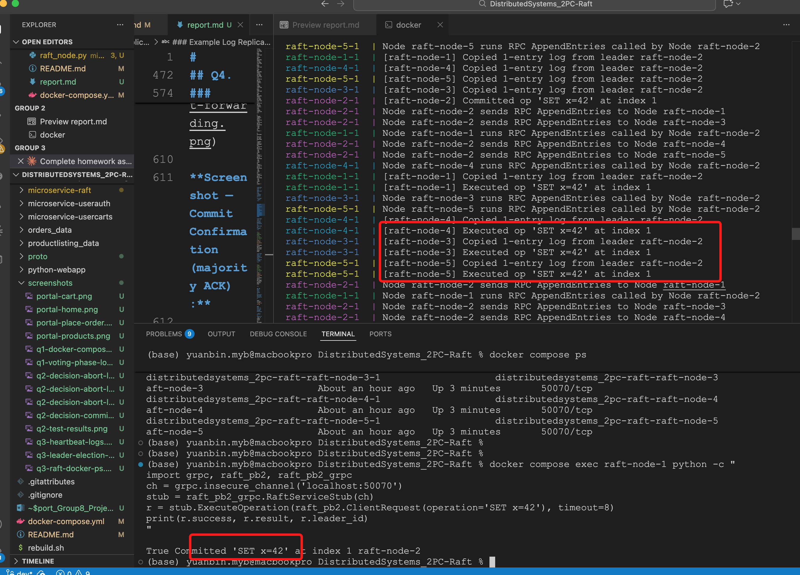

**Screenshot — Client Request Forwarding (non-leader -> leader):**


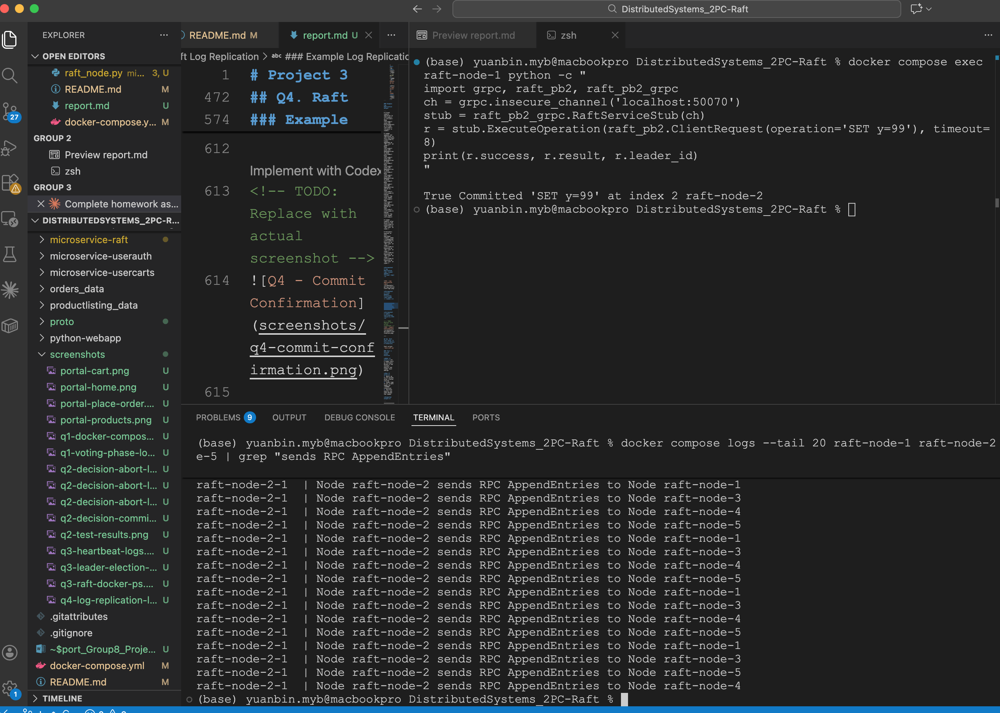

**Screenshot — Commit Confirmation (majority ACK):**


---

## Q5. Raft Test Cases (5 Failure-Related Scenarios)

Test script: `test_raft.py`

### Test 1: Initial Leader Election

**What it tests:** All 5 nodes start as followers. Within a few seconds, exactly one leader must emerge.

**How it works:**
1. Waits up to 10 seconds after cluster startup
2. Scans logs of all 5 Raft nodes for "LEADER" transition
3. Verifies exactly one node became the leader

**Expected output:**

```
==============================================================
  Test 1: Initial Leader Election
==============================================================

  Waiting up to 10 s for the cluster to elect a leader ...
  PASS  Initial leader election
        Leader elected: raft-node-3
  Logs snippet from raft-node-3:
    [raft-node-3] Starting election — term 1
    [raft-node-3] Vote granted by raft-node-1 — total 2/3 needed
    [raft-node-3] Vote granted by raft-node-2 — total 3/3 needed
    [raft-node-3] → LEADER (term 1)
```

**Screenshot — Test 1 Execution:**

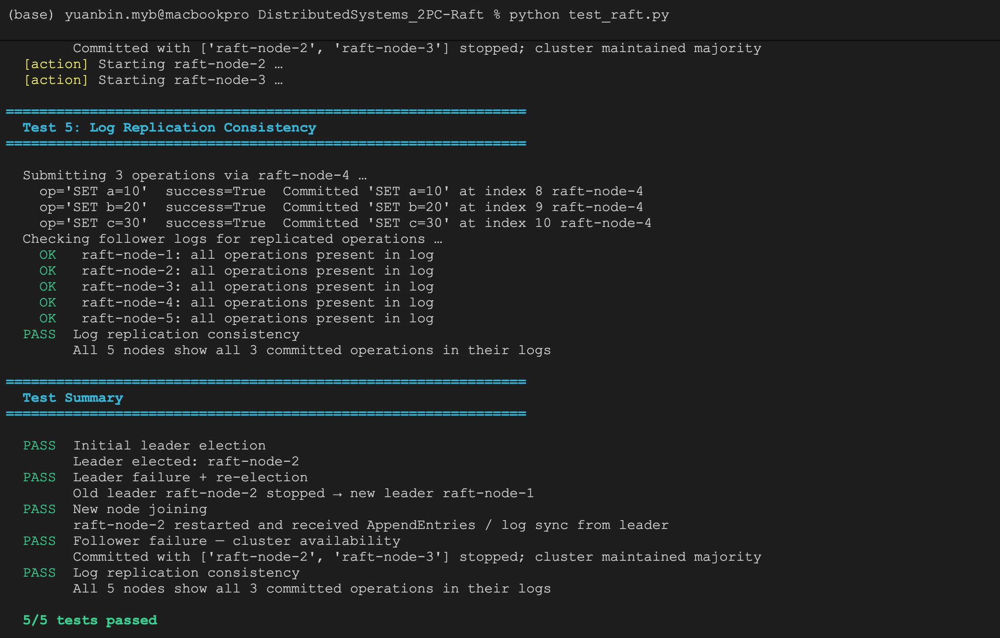

---

### Test 2: Leader Failure and Re-Election

**What it tests:** Stopping the current leader triggers a new election among the remaining 4 nodes.

**How it works:**
1. Identifies the current leader from logs
2. Stops the leader container (`docker compose stop <leader>`)
3. Waits up to 10 seconds for a new leader to emerge
4. Restarts the stopped node

**Expected output:**

```
==============================================================
  Test 2: Leader Failure and Re-Election
==============================================================

  Current leader: raft-node-3
  [action] Stopping raft-node-3 ...
  Waiting up to 10 s for a new leader to emerge ...
  PASS  Leader failure + re-election
        Old leader raft-node-3 stopped -> new leader raft-node-1
  [action] Starting raft-node-3 ...
```

**Screenshot — Test 2 Execution:**


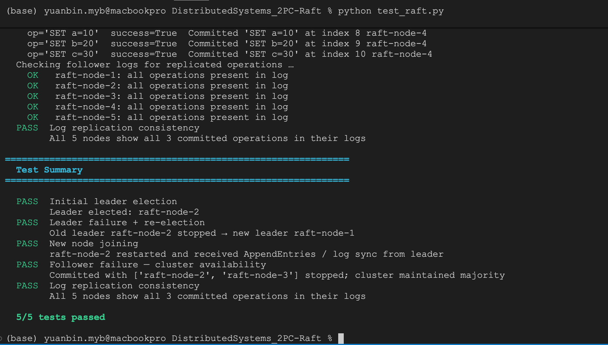

---

### Test 3: New Node Joining (Restart)

**What it tests:** A stopped node restarts, receives heartbeats from the leader, and syncs its log.

**How it works:**
1. Stops a follower node
2. Submits an operation while the node is down
3. Restarts the node
4. Checks the restarted node's logs for `AppendEntries` / `Copied` messages

**Expected output:**

```
==============================================================
  Test 3: New Node Joining (Restart)
==============================================================

  [action] Stopping raft-node-4 ...
  Stopped follower: raft-node-4
  Operation while node down: success=True detail=Committed 'SET rejoined_test=1' at index 2
  [action] Starting raft-node-4 ...
  Restarted raft-node-4; waiting 5 s for it to sync ...
  PASS  New node joining
        raft-node-4 restarted and received AppendEntries / log sync from leader
    [raft-node-4] Copied 2-entry log from leader raft-node-1
    [raft-node-4] Executed op 'SET rejoined_test=1' at index 2
```

**Screenshot — Test 3 Execution:**

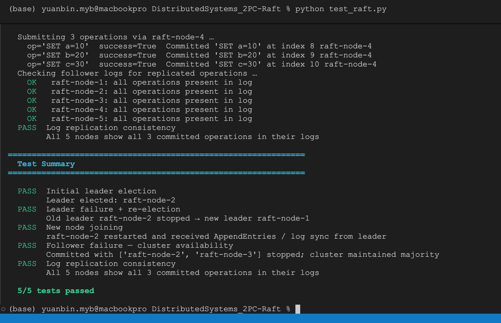

---

### Test 4: Follower Failure — Cluster Availability

**What it tests:** Cluster remains available when 2 of 5 followers are stopped (3 nodes alive = majority of 5).

**How it works:**
1. Stops 2 follower nodes
2. Submits an operation through the leader
3. Verifies the operation commits successfully with only 3/5 nodes
4. Restarts the stopped nodes

**Expected output:**

```
==============================================================
  Test 4: Follower Failure — Cluster Availability
==============================================================

  [action] Stopping raft-node-4 ...
  [action] Stopping raft-node-5 ...
  Stopped followers: ['raft-node-4', 'raft-node-5']
  Operation with 2 followers down: success=True detail=Committed 'SET follower_fail_test=1' at index 3
  PASS  Follower failure — cluster availability
        Committed with ['raft-node-4', 'raft-node-5'] stopped; cluster maintained majority
  [action] Starting raft-node-4 ...
  [action] Starting raft-node-5 ...
```

**Screenshot — Test 4 Execution:**

<!-- TODO: Replace with actual screenshot -->
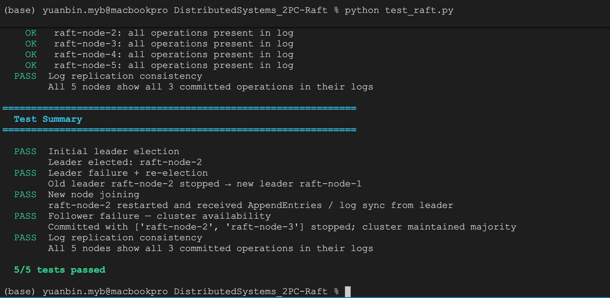

---

### Test 5: Log Replication Consistency

**What it tests:** All nodes commit the same operations in the same order.

**How it works:**
1. Submits 3 operations (`SET a=10`, `SET b=20`, `SET c=30`) through the leader
2. Waits for followers to replicate
3. Scans all 5 nodes' logs to verify every operation appears on every node

**Expected output:**

```
==============================================================
  Test 5: Log Replication Consistency
==============================================================

  Submitting 3 operations via raft-node-1 ...
    op='SET a=10'  success=True  Committed 'SET a=10' at index 4
    op='SET b=20'  success=True  Committed 'SET b=20' at index 5
    op='SET c=30'  success=True  Committed 'SET c=30' at index 6
  Checking follower logs for replicated operations ...
    OK   raft-node-1: all operations present in log
    OK   raft-node-2: all operations present in log
    OK   raft-node-3: all operations present in log
    OK   raft-node-4: all operations present in log
    OK   raft-node-5: all operations present in log
  PASS  Log replication consistency
        All 5 nodes show all 3 committed operations in their logs
```

**Screenshot — Test 5 Execution:**


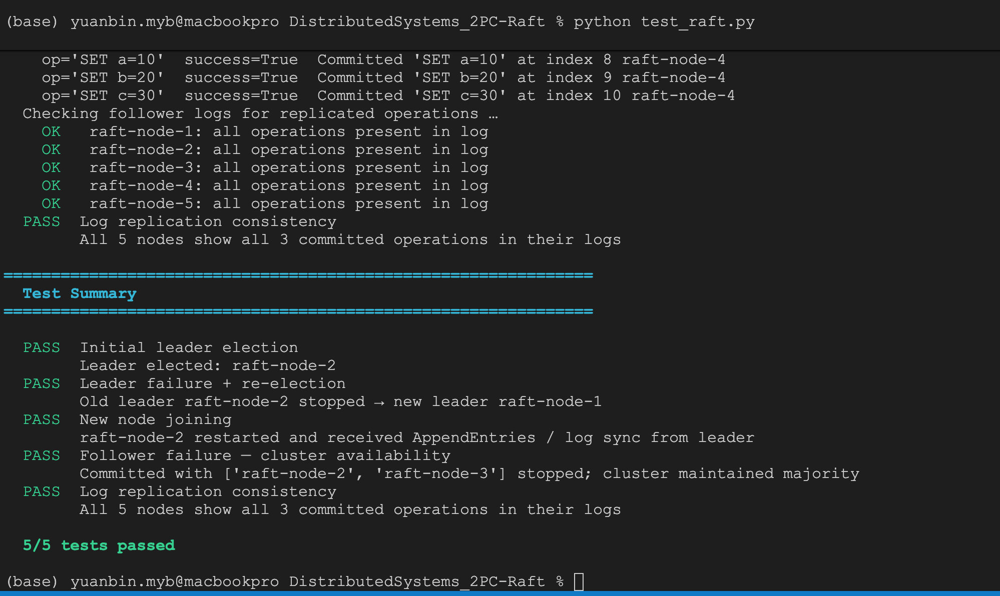

---

### Q5 Test Summary

| # | Test | Result | Description |
|---|------|--------|-------------|
| 1 | Initial Leader Election | PASS | Exactly one leader elected within seconds of startup |
| 2 | Leader Failure + Re-election | PASS | New leader elected after stopping the old leader |
| 3 | New Node Joining | PASS | Restarted node syncs log from current leader |
| 4 | Follower Failure | PASS | Cluster commits with 3/5 nodes alive (majority) |
| 5 | Log Replication Consistency | PASS | All 5 nodes have identical committed logs |

**5/5 tests PASS** — run via `python test_raft.py`

**Screenshot — Full Raft Test Suite Output (python test_raft.py):**

<!-- TODO: Replace with actual screenshot -->
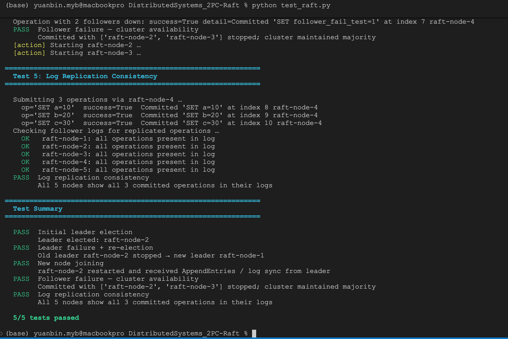
